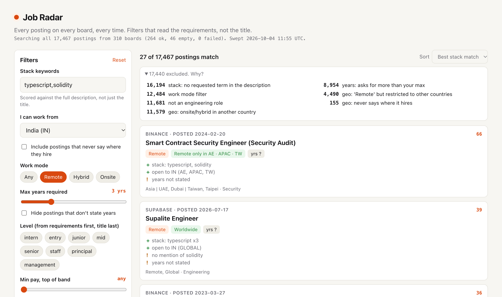

# Job Radar

Search company job boards straight from the Greenhouse, Ashby and Lever APIs, with filters that read the posting text: where you are actually allowed to work from, how many years the requirements ask for, and what the role pays. A CLI and a static web page for engineers who are tired of "Remote" meaning "Remote, US only".



The same search from the CLI (real output, sweep of 2026-10-04, trimmed with `--limit 2`):

```
$ python3 -m jobradar search --stack "typescript,solidity" --region IN --max-years 3 --remote --limit 2 --why-not 3
Searched ALL 17467 current postings from 310 boards (snapshot 2026-10-04T11:55:21+00:00). 27 match.

  1. [ 66.0] Binance | Smart Contract Security Engineer (Security Audit)
       remote | AE, APAC, TW | yrs ? | level ? | visa unknown
       https://jobs.lever.co/binance/0477fd3b-581b-4b1a-a613-264e376d0401
       + stack: typescript (1x in description); solidity (1x in description)
       + open to IN (regions: AE, APAC, TW; from location)
       ! years not stated

  2. [ 39.0] Supabase | Supalite Engineer
       remote | GLOBAL | yrs ? | level ? | visa unknown
       https://jobs.ashbyhq.com/supabase/b75ba81e-54cc-4393-a575-bc41776b0113
       + stack: typescript (3x in description)
       + open to IN (regions: GLOBAL; from location)
       ! no mention of solidity
       ! years not stated

... 25 more (use --limit)

27 of 27 matches were first posted more than 30 days before this snapshot.

Excluded (a posting can have several reasons):
   16194  stack: no requested term in the description
   12484  work mode: not remote
   11681  not an engineering role
   11579  geo: onsite/hybrid in another country
    8954  years: asks for more than your max
    4490  geo: 'Remote' but restricted to other countries
     155  geo: never says where it hires

Best stack matches you are NOT seeing, and why:
  [ 69.0] Ondo Finance | Senior Full-Stack Engineer (Web3) | https://job-boards.greenhouse.io/ondofinance/jobs/4297411009
          - Remote, but only US; not open to IN
          - requires 4+ years (max 3)
  [ 66.0] Consensys | Software / Systems Architect | https://jobs.ashbyhq.com/consensys/d9b8d708-5f7a-4320-af00-872f7801c62a
          - Remote, but only EUROPE, US; not open to IN
  [ 66.0] Ondo Finance | Senior Blockchain Engineer | https://job-boards.greenhouse.io/ondofinance/jobs/4297412009
          - Remote, but only US; not open to IN
          - requires 5+ years (max 3)
```

## Why

Job Radar came out of three mistakes in a real job search.

- **A diff is not a search.** A daily script printed only postings that were new since its last run. When all 184 boards were finally pulled and filtered from scratch, the best stack match of the whole search had been live for weeks. It never surfaced because it was never new on a day the script ran. Job Radar always searches the full current set. In the run above, all 27 matches had been posted more than 30 days earlier.
- **"Remote" is a work mode, not a geography.** A "Remote" role at a card company was open only to the US, Canada (Ontario or BC only), the Netherlands, Poland and Czechia, with no visa sponsorship. Across the 996 engineering postings with "Remote" in the location field, 950 are limited to named countries or regions and 20 are open worldwide.
- **A job title is not a level.** A plainly titled "Software Engineer, Internal Systems" asked for 8+ years, while "Backend Engineer E2" was the real fit. Of the 995 plain-titled engineering roles that state years, 506 (51%) ask for 5 or more.

### How these numbers were measured

One full sweep of the 310 boards in `seeds/boards.json`, started 2026-10-04 11:39 UTC and finished 11:55 UTC, run from an Apple M4 laptop on macOS 27 with Python 3.14 over a home connection. Result: 264 boards with openings, 46 empty, 0 errors, 17,467 postings, 5,786 of them engineering. The figures come from `jobradar stats` and the search above, with the payloads re-read by the current parsers (`jobradar reparse`, 2026-10-05). They are a snapshot of those boards on that day, and the parsers are heuristic (see [Limitations](#limitations)), so treat them as measured approximations. Two sweeps run back to back the same morning found 0 new and 0 closed postings, which is the idempotency check.

## Quickstart

Python 3.10 or newer, no dependencies. Run from a clone of the repo, because the seed list lives in `seeds/`.

```bash
git clone https://github.com/agnij-dutta/jobradar.git
cd jobradar

# Try it offline against the bundled sample (five synthetic postings):
python3 -m jobradar search --snapshot tests/fixtures/sample_snapshot.json --stack typescript --region IN

# Real data: sweep a few boards (seconds), then search them
python3 -m jobradar sweep --only stripe,bitgo,squads,supabase
python3 -m jobradar search --stack "typescript,go" --region IN --max-years 3

# Or sweep every board in seeds/boards.json (310 boards, 5 to 20 minutes depending on your connection)
python3 -m jobradar sweep
python3 -m jobradar stats

# Web UI: build dist/ and open it (works from disk, or serve it)
python3 -m jobradar build
python3 -m http.server 8787 -d dist   # then open http://localhost:8787
```

`pip install -e .` installs a `jobradar` command so you can drop the `python3 -m`.

## Usage

### Commands

| command | what it does |
|---|---|
| `jobradar sweep` | Fetch every board in `seeds/boards.json`, parse every posting, update SQLite history and write `data/snapshot.json`. |
| `jobradar search` | Search the full current snapshot. Flags below. |
| `jobradar stats` | Aggregate numbers over the snapshot (`--home IN` sets the country, `--json` for raw output). |
| `jobradar build` | Build the static web UI into `dist/` (`--snapshot PATH`, `--out DIR`). |
| `jobradar reparse` | Re-run every parser over the saved raw payloads in `data/raw/`. No network. Use it after changing a parser. |
| `jobradar probe` | Try every slug in `seeds/candidates.json` on all three ATSs and rewrite `boards.json`, `dead.json` and `probe-review.json`. |

`sweep` and `probe` take `--workers N` (default 12) and `--only slug1,slug2`. `sweep --fail-on-error` exits with status 2 if any board errored. `probe --dry-run` prints counts without writing.

### `jobradar search` flags

| flag | meaning |
|---|---|
| `--stack a,b` | Score the full description for these terms. Aliases work: `ts`, `golang`, `k8s`, `nodejs`, `web3`. |
| `--region IN` | Keep only postings open to someone living in this country (ISO code; the UK is `UK`). Region words resolve, so APAC includes IN and EMEA does not. |
| `--include-unverified` | Also keep postings that never say where they hire, with a caveat. |
| `--max-years N` | Drop postings whose required minimum years exceed N. Postings that state no years are kept with a caveat. |
| `--strict-years` | Also drop postings that state no years. |
| `--level a,b` | Ladder: `intern, entry, junior, mid, senior, staff, principal, management`. |
| `--remote` | Work mode remote only. |
| `--min-comp N` | Top of the published band at least N USD per year (approximate FX). |
| `--require-comp` | Drop postings without a published band. |
| `--needs-visa` | Drop postings that say there is no visa sponsorship. |
| `--all-roles` | Include non-engineering roles (default is engineering only). |
| `--company RE`, `--title RE`, `--text RE` | Regex filters on company/slug, title, and title plus description. |
| `--new-since last` or `--new-since ISO` | The diff view: only postings first seen after the previous sweep, or after a timestamp. |
| `--min-score N` | Minimum stack score (0 to 100). |
| `--limit N` | Results to print (default 25). |
| `--why-not N` | Show the N best stack matches that a filter removed, and which filter (default 5). |
| `--snapshot PATH` | Search a different snapshot file. |
| `--json` | Machine-readable output, including the exclusion summary. |

### Web UI

The page in `dist/` filters a slim copy of the snapshot in the browser: country you can work from, work mode, max years, level, minimum pay, stack keywords, visa, engineering only, and title or company. Every badge shows its evidence sentence on hover. "Only new since last sweep" is a checkbox and is off by default. Filters are stored in the URL, so a view can be shared as a link.

### Python API

```python
from jobradar.store import load_snapshot
from jobradar.search import Query, run

snap = load_snapshot()  # data/snapshot.json
hits, misses = run(snap["postings"], Query(stack=["rust"], region="IN", max_years=3, remote=True))
for h in hits:
    print(h.score, h.posting["company"], h.posting["title"], h.why, h.caveats)
```

The parsers are usable on their own: `jobradar.parse_geo.parse_geo(locations, description)`, `jobradar.parse_level.parse_level(title, description)`, `jobradar.parse_sponsorship.parse_sponsorship(description)` and `jobradar.parse_comp.from_text(description)`.

### Environment variables

All optional; see `.env.example`.

| variable | default | meaning |
|---|---|---|
| `JOBRADAR_DATA_DIR` | `./data` | Snapshot, SQLite history and raw payloads. |
| `JOBRADAR_SEEDS_DIR` | `./seeds` | `boards.json`, `candidates.json`, `dead.json`, `collisions.json`. |
| `JOBRADAR_USER_AGENT` | `jobradar/0.1 (+repo URL)` | User-Agent sent to the ATS APIs. Add contact details if you run large sweeps. |
| `JOBRADAR_PER_HOST_CONCURRENCY` | `3` | Max concurrent requests per ATS host. |
| `JOBRADAR_MIN_INTERVAL_S` | `0.25` | Minimum seconds between request starts per host. |

## How it works

```
seeds/boards.json
      |
      v
  fetch (parallel, 3 per host, 250 ms spacing, retry on 429/5xx)
      |            \
      |             +--> data/raw/<ats>__<slug>.json.gz   (last good payload, for `reparse`)
      v
  adapter.extract()  -> raw fields (title, url, description, location strings, ATS country, pay)
      |
      v
  parsers: geography + work mode, sponsorship, years + level, pay band, stack tags
      |
      v
  SQLite history (first_seen / last_seen / closed_at)  ->  data/snapshot.json
      |
      +--> jobradar search / stats      +--> jobradar build -> dist/ (static web UI)
```

**Fetching.** Every board ends a sweep in exactly one state: `ok`, `empty` or `error`. A board that errors keeps its previously known postings, marked stale, because an error is never treated as "this company has no jobs". A board that was verified earlier and now returns 404 is also an error, not an empty board. The last good payload per board is kept so parsers can be re-run offline.

**Adapters** (`jobradar/ats.py`). Each ATS is one small class that knows its two endpoints, where the job list sits in the response, and how to pull raw fields out of one job. Parsing is shared.

**Geography** (`parse_geo.py`). A gazetteer of countries, regions (EMEA, APAC, LATAM and so on), US states, Canadian provinces, Indian states, cities, and the abbreviations boards really use (`SF, SEA, NYC`, `US-REM`, `Vancouver, BC`). The location field is read first. Restriction sentences in the description ("open to candidates located in ...", "must be based in ...", "we cannot hire in ...") are used when the location field names no place, while company HQ, customer and pay-transparency sentences are ignored. A global word next to named places ("Remote Global (US, EU)") is read as a restriction. The ATS's own country field is the last resort. Work mode is kept as a separate field.

**Years and level** (`parse_level.py`). Reads "5+ years", "3-5 yrs", "at least four years", "Five (5) or more years", and degree-or-experience alternatives (the easier path wins). Nice-to-have sections are kept separate, and benefits sentences (vesting, sabbaticals) and the company describing itself are ignored. The level comes from required years first, then explicit codes (E2, L4, IC3, Engineer II, with L1/L2 ignored because in crypto they mean chain layers), then title words.

**Sponsorship, pay, stack.** Explicit refusals beat offers, and "must already be authorized to work in X" is recorded as an inferred no. Pay comes from Ashby and Lever structured fields first, then from ranges in the text that sit next to a pay word. Stack terms are regexes that tell Go the language from "go to market" and Java from JavaScript.

**History and search.** SQLite records when each posting was first and last seen, so re-running a sweep is idempotent and "new since" is a cheap view. Search always runs over the full snapshot, and every posting ends up either matched (with reasons) or excluded (with reasons).

### Seeds

- `seeds/candidates.json`: slugs to try. `jobradar probe` tries each one on all three ATSs.
- `seeds/boards.json`: 310 boards that answered, with company name and category (89 crypto, 78 fintech, 73 devtools, 68 AI, 2 other).
- `seeds/dead.json`: 336 slugs that 404 on every ATS.
- `seeds/collisions.json`: 28 slugs that belong to an unrelated company with the same name (Safe Software instead of Safe, circle.so instead of Circle, a pizza app called Slice). These are kept out of the sweep.
- `seeds/probe-review.json`: boards whose identity could not be confirmed automatically.

## Limitations

- **Parsing is heuristic.** Geography, years, level, sponsorship and pay are read from free text and can be wrong. The CLI and web UI show the sentence each value came from so you can check it before applying. A wrong "not open to your country" can hide a real opportunity, and that is why `--why-not` exists.
- **No sponsorship guarantee.** "unknown" is the most common sponsorship value, because most postings never say. "yes" means the text offers it, not that the company will sponsor you.
- **Level codes are not portable.** E2 at one company is not E2 at another. Required years beat codes, and codes beat title words.
- **Pay in USD is approximate.** Fixed exchange rates, annualized at 2,080 hours for hourly bands. Greenhouse's list endpoint has no structured pay, so Greenhouse bands come from the text only.
- **Coverage is the seed list.** Only Greenhouse, Ashby and Lever, and only the companies in `seeds/boards.json`. Many companies, including many Indian startups, use other systems.
- **Personal data.** Job Radar fetches public job postings and stores nothing about you. Everything stays in `data/` on your machine. The web build publishes posting data only; deploy it only if you are fine republishing public postings.
- **Be polite.** The APIs are public and keyless. The defaults (3 requests per host at a time, 250 ms apart) keep a full sweep gentle. Please keep it that way.

## Prior art

- [JobSpy](https://github.com/speedyapply/JobSpy) scrapes LinkedIn, Indeed, Glassdoor and others. Job Radar instead reads company ATS boards directly, with no aggregator in the middle, and its focus is parsing eligibility and requirements rather than collecting listings.
- The public board APIs it is built on: [Greenhouse Job Board API](https://developers.greenhouse.io/job-board.html), [Ashby posting API](https://developers.ashbyhq.com/docs/public-job-posting-api), [Lever postings API](https://github.com/lever/postings-api).
- Remote-job boards such as [We Work Remotely](https://weworkremotely.com) and [Remote OK](https://remoteok.com) curate remote roles, but location eligibility is still whatever the poster wrote. Job Radar parses it into a field you can filter on.
- [Levels.fyi](https://www.levels.fyi) maps level codes across companies from reported data. Job Radar reads the level a single posting implies from its own requirements.

## Roadmap

- More sources: Workable, SmartRecruiters, Recruitee and Workday adapters (the adapter interface is in `jobradar/ats.py`).
- A labelled sample of postings to measure precision and recall for the geography, years and pay parsers, instead of spot checks.
- Use Greenhouse's per-job pay endpoint for roles where pay only appears in the text today.
- Smarter merging when the location field and the description name different countries. Today the location field wins, which avoids company boilerplate but can drop a real extra country.
- Scheduled sweeps (cron or GitHub Actions) so the "new since" view has a long history.
- A smaller web data file, for example per-category shards loaded on demand.

## Contributing

See [CONTRIBUTING.md](CONTRIBUTING.md). Adding a company is a one-line change to `seeds/candidates.json`, and adding an ATS is one adapter class.

## License

[MIT](LICENSE)

## Author

Agnij Dutta ([@0xholmesdev](https://x.com/0xholmesdev), [github.com/agnij-dutta](https://github.com/agnij-dutta))
